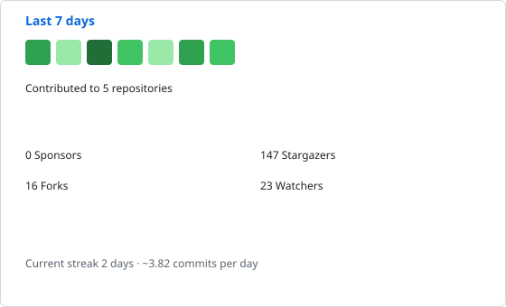
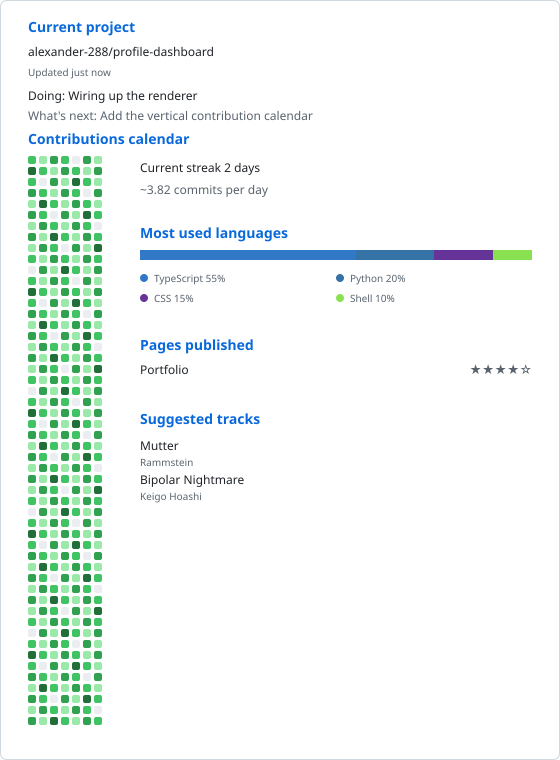
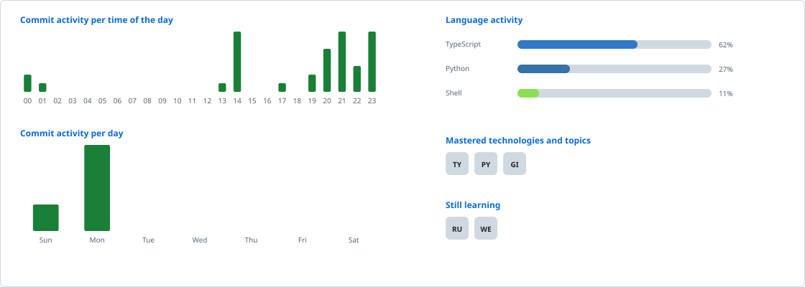

<table>
  <tr>
    <td>
      <picture>
        <source media="(prefers-color-scheme: dark)" srcset="out/identity-dark.svg">
        
      </picture>
    </td>
    <td>
      <picture>
        <source media="(prefers-color-scheme: dark)" srcset="out/pulse-dark.svg">
        
      </picture>
    </td>
    <td rowspan="2">
      <picture>
        <source media="(prefers-color-scheme: dark)" srcset="out/dashboard-dark.svg">
        
      </picture>
    </td>
  </tr>
  <tr>
    <td colspan="2">
      <picture>
        <source media="(prefers-color-scheme: dark)" srcset="out/habits-dark.svg">
        
      </picture>
    </td>
  </tr>
</table>
